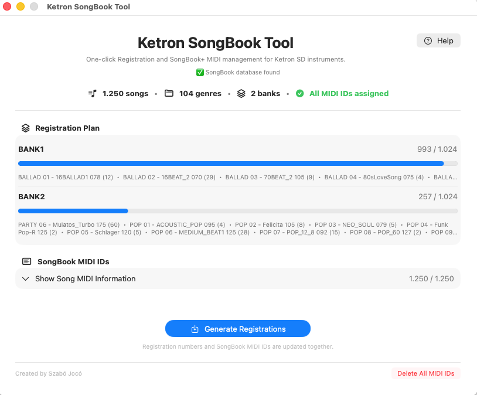
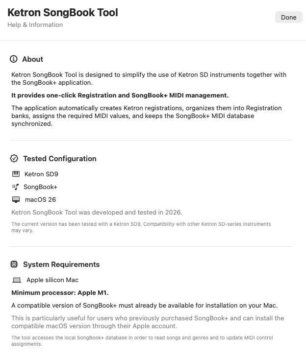

# Ketron SongBook Tool

**One-click Registration and SongBook+ MIDI management for Ketron SD instruments.**

Ketron SongBook Tool is a free macOS application designed to simplify the use of Ketron SD instruments together with the SongBook+ application.

It automatically creates Ketron Registration files, organizes songs into Registration banks, assigns the required MIDI values and keeps the SongBook+ MIDI database synchronized.

---
## Screenshots

### Main Window

### Help & Information

---

## Features

- Reads songs and genres directly from the SongBook+ database
- Automatically organizes songs into Ketron Registration banks
- Keeps genres together whenever possible
- Generates Ketron `.srg` Registration files
- Automatically assigns MSB, LSB and Program Change values
- Updates SongBook+ MIDI assignments automatically
- Designed for a simple one-click workflow
- Includes MIDI setup and troubleshooting instructions
- Completely free to use

---

## Tested Configuration

Ketron SongBook Tool was developed and tested in 2026 with:

- **Ketron SD9**
- **SongBook+**
- **macOS 26**
- **Apple Silicon Mac**

The current version has been tested with a Ketron SD9. Compatibility with other Ketron SD-series instruments may vary.

---

## System Requirements

- Apple Silicon Mac
- Minimum recommended processor: **Apple M1**
- macOS 26
- A compatible version of SongBook+ installed on the Mac

The application accesses the local SongBook+ database in order to read songs and genres and update MIDI control assignments.

---

## How It Works

1. Ketron SongBook Tool reads the songs and genres stored in SongBook+.
2. Songs are organized into Ketron Registration banks.
3. The program generates the required `.srg` Registration files.
4. MSB, LSB and Program Change values are assigned automatically.
5. The SongBook+ database is updated with the same MIDI assignments.
6. Selecting a Registration on the Ketron can then automatically open the corresponding song in SongBook+.

---

## MIDI Setup

If SongBook+ does not react when selecting a Ketron Registration, check the following settings.

### Ketron SD

Go to:

**MIDI → STANDARD → ARRANGER KEYBOARD**

Under **TX**:

- Set **REG** to **MIDI Channel 16**

Under **FILTER**:

- Enable all filters so they are orange/yellow
- **PROGRAM CHANGE must remain disabled**
- System Exclusive filtering should be enabled

### SongBook+

Go to:

**Settings → MIDI**

Set:

- **MIDI Channel: 16**
- **MIDI IN: Enabled**

When both devices are configured correctly, selecting a generated Ketron Registration should automatically open the corresponding song in SongBook+.

---

## Download

The latest version of Ketron SongBook Tool can be downloaded from the **Releases** section of this repository.

> Please note: the application is currently distributed outside the Mac App Store.

---

## Feedback and Support

If you experience any problems, notice something that could be improved, or have an idea for a new feature, feel free to contact me.

**Email:** szabojoco@szabojoco.ro

Bug reports, feedback and ideas are always welcome.

---

## Support the Project

Ketron SongBook Tool is completely free to use.

A lot of time, testing and development work went into creating this application. If the program has been useful to you and you would like to support its continued development, any small contribution is greatly appreciated.

**Revolut:** `@szabojoco`

Supporting the project is entirely optional. The application remains fully functional and free.

---

## Author

**Created by Szabó Jocó**

2026

Website: www.szabojoco.ro
